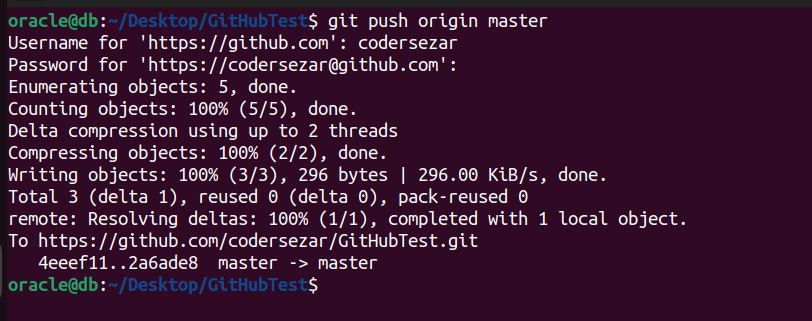
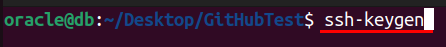
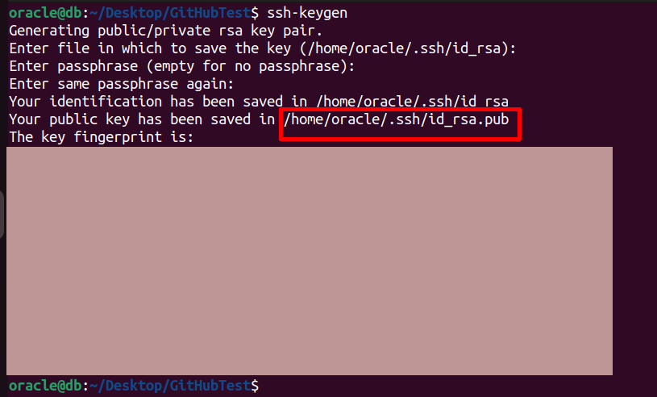
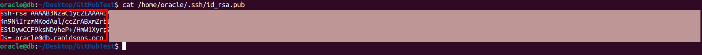
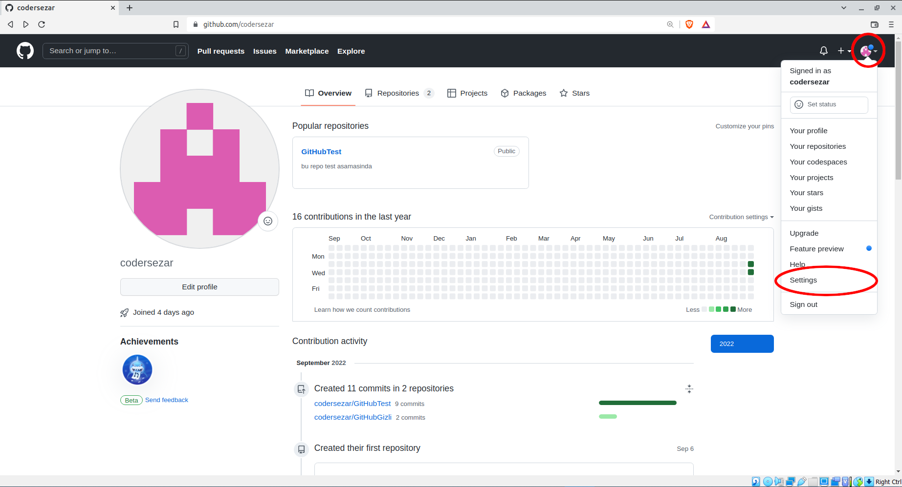
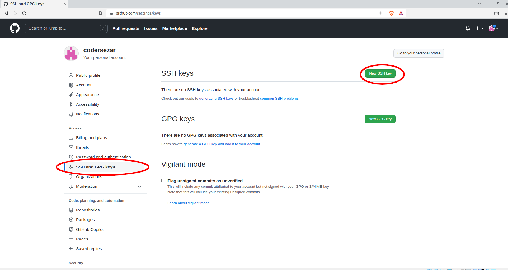
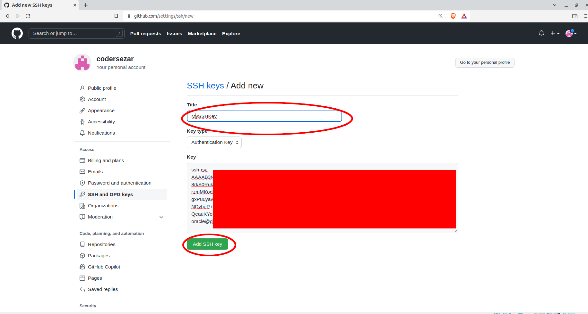
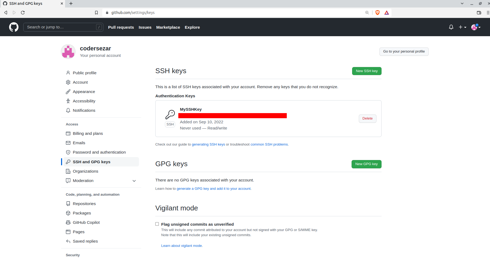

# <center>Bazı Hatalar</center>

> **Eğer Push işlemlerinde hata alıyorsanız ya da Push işlemlerinde sistem sizden şifre istiyorsa aşağıdakı adımlarla bu sorunları ortadan kaldırabilirsiniz.**



> **Adımları teker teker ve dikkatli bir şekilde uygulayınız.**

> **Öncelikle ```ssh-keygen``` komutu ile SSH Anahtarımızı oluşturalım.**



> **Bu komuttan 3 adet soru sorulacaktır. Enter'a basarak bu soruları geçelim. Sonunda bu çıktıyı almalıyız.**



> **Kırmızı kutu içerisinde bulunan dosya yolunu kopyalayalım ve ```cat``` komutu ile içeriğine erişim sağlayalım.**



> **Uzun bir çıktı alıcaz. Bu çıktıyı kopyalayalım ve Githubımıza girelim. ```Settings > SSH and GPG Keys > New SSH Keys``` kısmına gelelim.**







> **Title kısmını, Key Type ve Key kısmını görüntüdeki gibi doldurduktan sonra ```Add SSH Key``` butonuna basalım. Sonuç şöyle olmalı;**

