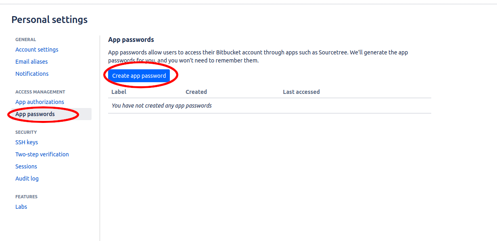

# <center>Bitbucket Kursu</center>


<br />

> **Hoşgeldiniz. Git-Github eğitimimiz sona ermiştir. İlerde güncellemeler ile eğitimlerimizi güncelleyebiliriz. Umarım verimli bir eğitim olmuştur.**

> **Bugün Bitbucket eğitimine başlayabiliriz. Bitbucket ve Github aslında benzer şeyler ama farklar var. O zaman öncelikle Bitbucket nedir sorusuna bir cevap verelim.**

> **Bitbucket, Git veya Mercurial gibi VCS(Version Control System) kullanan projeler için bir web depolama servisidir.**

<br />

## ``` Nasıl Kayıt Olunur ?```

<br />

> **```https://bitbucket.org/``` Öncelikle bu link ile bitbucket sitesine erişelim. Aşağıdaki adımları uygulayarak kayıt işlemini tamamlayabiliriz.**

<br />


<br />


<br />


<br />


<br />

> **Evet, ekran görüntülerine uyarak bütün adımları tamamladıysanız artık kayıt işlemleri bitmiştir demektir. Şimdi gelelim Repository oluşturmaya.**

<br />


<br />


<br />

> **Kavramlardan bahsetmek istiyorum. Aslında diğer kursları bitirdiyseniz hakimsinizdir kavramlara lakin bilmeyenler için bahsedelim.**

> **```Repository``` - Bir yazılım havuzu veya kısaca repo, yazılım paketleri için bir depolama yeridir. Çoğu zaman, meta verilerle birlikte bir içindekiler tablosu da saklanır. Bir yazılım havuzu, genellikle kaynak denetimi veya havuz yöneticileri tarafından yönetilir.**

> **```Branch``` - Sürüm kontrolü ve yazılım konfigürasyon yönetiminde dallanma, sürüm kontrolü altındaki bir nesnenin kopyalanmasıdır.**

> **```.gitignore``` - Git ignore dosyası ile, bazı uzantı veya dizindeki dosyaların git’e gönderilmesini ve değişikliklerin takip edilmesini engellemiş oluruz.**

> **```Fork``` - Katkı yapmak istediğiniz projenin birebir kopyasıdır. Yapacağımız tüm geliştirmeleri bu fork repo üzerinde yapacağız. Projeyi Forkladıktan sonra birebir kopyası kendi repolarım arasında gözükecek.**

<br />

> **Repository'i indirme, dosya ekleme, forklama ve birçok fonksiyona üç noktaya basarak ulaşabiliriz.**

<br />


<br />

> **```Add file``` diyerek bir dosya oluşturalım.**


> **Commit butonuna basarak yaptığımız değişiklikleri sunalım. İlk dosyamızı oluşturduk.**

> **Şimdi bu repo'yu VS Code'a aktaralım. Adımları teker teker uygulayınız.**

<br />


<br />



<br />


<br />

> # **Burada bize bir adet şifre vericek bu şifreyi kopyalayalım.**

<br />


<br />


<br />


<br />


<br />


<br />


<br />


<br />


<br />

> # **Nereye kayıt edileceğini seçiyoruz. Ardından şifre isteyecektir şifre kısmına kopyaladığımız şifreyi yapıştıralım.**

<br />


<br />

> **Evet bu şekilde VS Code'a dahil ettik.**

> **Repoyu silmek için aşağıdaki işlemler uygulanır.**

<br />


<br />


> ## **Birçok fonksiyonu (push, pull, ...) göstermek istemedim. Çünkü bunlar Git ve Github kursumuzda zaten yer almakta. Bu kurs sadece Bitbucket Temeli için oluşturulmuştur.**

