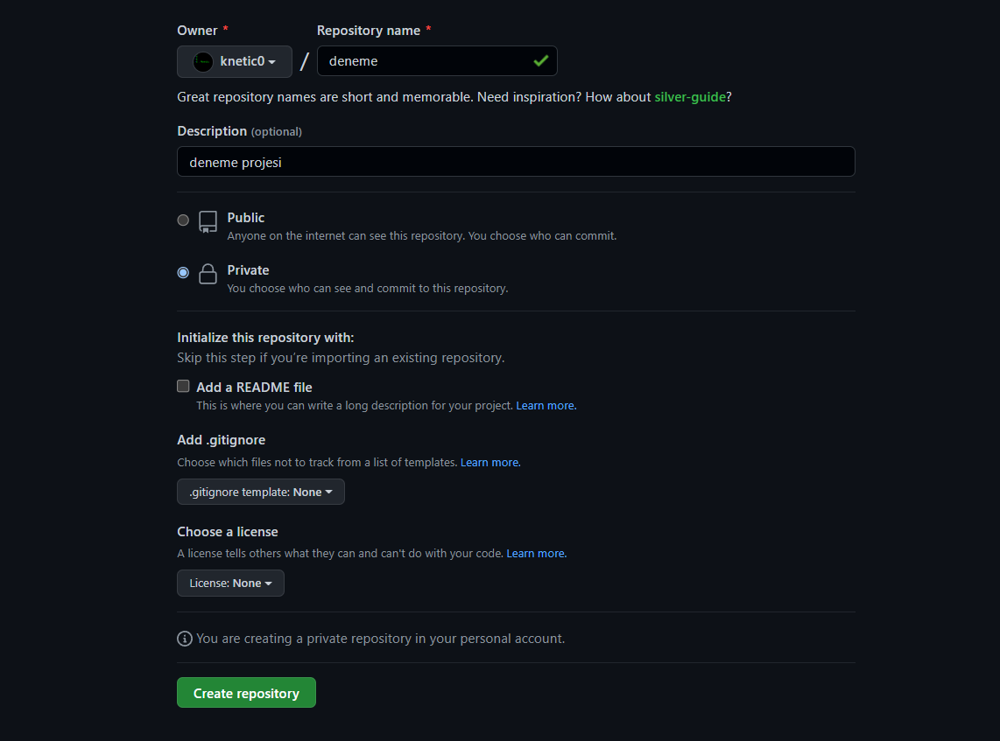
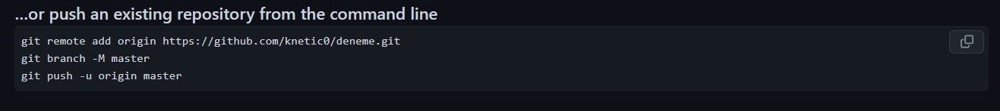

# <center>Git Kullanımı </center>


<br />

> ## Git Nedir ?
<br />

**Git, yazılım geliştirme süreçlerinde kullanılan, hız odaklı, dağıtık çalışan bir sürüm kontrol ve kaynak kod yönetim sistemidir. Git sürüm kontrol sistemini kullanan her bir çalışma dizini (proje), internet erişimi ya da merkezi bir depo olmaksızın tüm tarihçeyi tutan ve sürüm kontrol sisteminin tamamını içinde barındıran tam yetkili birer depodur. Ayni çalışma dizininin birçok depodan birindeki kopyasında yapılan değişiklikler diğerlerine güven temelli bir değerlendirmeyle kabul edilir; Güvenilmeyenden değişiklik alınmaz, o kendi ayrı sürümünü geliştirmeye devam eder.**

<br />

> ## Git Nasıl İndirilir ?

<br />

```
https://git-scm.com/downloads
``` 

**Bu link aracılığıyla işletim sisteminize göre Git'i bilgisayarınıza indirip kurabilirsiniz.**

**Debian tabanlı işletim sistemleri =>** ```sudo apt get install git```
<br />

**Fedora (Fedora 21) =>** ```sudo yum install git```
<br />

**Fedora (Fedora 22 ve sonrası) =>** ```sudo dnf install git```
<br />

**Arch Linux =>** ```pacman -S git```

> ## Git Nasıl Kullanılır ?

<br />

**Öncelikle Git Ayarlarımızı Yapalım. Kullanıcı adımızı ve email adresimizi tanıtalım. Bu değerler *commit* vb işlemlerde otomatik olarak kullanılır.**

```
git config --global user.name "<kullanıcıadınız>"
git config --global user.mail "<mailadresiniz>"
```

**Önemli olan ayarlarımızı yaptık. Artık Başlayabiliriz.**

**Projemizin olduğu klasöre girip burada Terminalimiz açıyoruz. Windows kullanıyorsanız CMD'yi açmalısınız ve cd komutları ile klasörümüze erişiyoruz.**

<br />

> ### Eğer Sıfırdan Bir Proje Oluşturuyorsanız ya da Repository clone işlemi yapmadıysanız ya da Öğrenmeye yeni başladıysanız buradan başlayınız.

<br />

**Henüz versiyon kontrolünde olmayan bir projeniz varsa öncelikle versiyon kontrolüne almalıyız. Eğer bundan emin değilseniz aşağıdaki komutu çalıştırınız.**

```
git status
```

**Bu komut ile projemiz versiyon konrolünde mi değil mi sorusuna cevap buluyoruz. Eğer aşagıdaki kod ile karşılaşırsanız projeniz versiyon kontrolunde degildir.**

```Aslında ne olursa olsun girdiğiniz bütün proje dosyalarında öncelikle "git status" komutu çalıştırılır. Çıktıya göre devam edilir.```

```
fatal: not a git repository (or any of the parent directories): .git
```

**Aşağıdaki komut ile projemizi versiyon kontrolüne alalım.**

```
git init
```

**Ardından yeniden ```git status``` yazalım ve çıktımızı inceleyelim.**

```
On branch master

No commits yet

nothing to commit (create/copy files and use "git add" to track)
```

**Eğer yeni bir proje oluşturuyorsanız sizde bu çıktıyı alıcaksınız. Var olan bir projeniz varsa aşağıdaki çıktıya yakın bir çıktı alıcaksınız.**

```
On branch master

No commits yet

Untracked files:
  (use "git add <file>..." to include in what will be committed)
        .gitignore
        go.mod
        main.go
        modsrc/

nothing added to commit but untracked files present (use "git add" to track)
```

**Klasörümüz içerisinde bir adet dosya oluşturalım aşağıdaki komut ile.**

```
touch main.py
```
**Dosyamıza ```print("Hello World!")``` yazalım ve kaydedip terminalimize geri dönelim.**

**Ardından ```git status``` komutunu yeniden çalıştıralım.**

```
On branch master

No commits yet

Untracked files:
  (use "git add <file>..." to include in what will be committed)
        main.py

nothing added to commit but untracked files present (use "git add" to track)
```

**Bize verilen görevin sadece ekrana Hello World! yazdırmak olduğunu varsayalım. Görevimiz bitti ve bunu sunmalıyız. Yukarıdaki çıktıda bundan bahsediyor. Bir dosya var ve bu dosyayı sunmadın. Peki nasıl bu dosyayı sunabiliriz yani Commit işlemine geçiyoruz.**

<br />

> ## Commit İşlemi Nedir ? Nasıl Yapılır ?
<br />


<br />
<br />

> **Working directory > Klasörümüz, çalışma alanımız.**
<br/>

> **Staging area > Bir hazırlama alanı veya iniş alanı, çıkarma, dönüştürme ve yükleme işlemi sırasında veri işleme için kullanılan bir ara depolama alanıdır.**

> **Repository > Bir yazılım havuzu veya kısaca repo, yazılım paketleri için bir depolama yeridir.**

<br />

**Commit, kelime anlamı olarak “işlemek” demektir. Git’e eklediğimiz dosyaları kalıcı olarak Git veri tabanına işlemeye commit denir.**

**Öncelikle main.py dosyasını Git veri tabanına işlemeliyiz.**

```
git add .
```

**Bu komut nedir ? Bir dosya bir depoya kaydedilmeden önce, dosyanın Git hazırlama alanına eklenmesi için ```git add .``` komutu kullanılır. Buradaki nokta bütün dosyaları ekle anlamına gelir. Eğer belirli dosyaları eklemek istiyorsak ```git add main.py``` komutu kullanılır. Bu komuttan sonra yeniden ```git status``` komutunu çalıştıralım.**

```
On branch master

No commits yet

Changes to be committed:
  (use "git rm --cached <file>..." to unstage)
        new file:   main.py
```

**Bu komut başarılı bir şekilde alana eklediğimizi anlatmaya çalışıyor. Şimdi commit işlemine geçelim.**

```
git commit -m "Hello World! yazıldı."
```

**Bu şekilde git veri tabanına ekledik. Buradaki -m komutundan sonra ne yaptığımızı açıkça belirtmeliyiz. ```git status``` komutunu bir daha yazalım.**

```
On branch master
nothing to commit, working tree clean
```

**İlk Commit işlemimizi tamamladık.**

**```git log``` Komutu ile atılan Commitlere bakabiliriz.**

```
Author: Mehmet Solak <72500821+knetic0@users.noreply.github.com>
Date:   Sun Sep 4 20:08:15 2022 +0300

    Hello World! Yazıldı.
```

**Çıktımız bu şekilde.**

> ## Branching (Dallanma) ve Merging (Birleştirme)

> ### Branch Nedir ?

<br />

**Branch oluşturmak kullanıcıya çalıştığı projenin farklı versiyonlarına erişmesini sağlar. Kullanıcı, projesine bir yenilik eklemek istediğinde, yaptığı değişiklik projenin çalışmasını olumsuz etkileyebilir. Bu gibi durumlarda projemizin o anki halini bozmamak için branch kullanabiliriz.**

**Git bizlere varsayılan olarak Master adında bir branch oluşturur. ```git branch``` komutu ile branchlere bakabiliriz.**

```
* master
```

**Evet, şu anda master adında bir adet branch'e sahibiz.**

**```git branch <branchadi>``` komutu ile branch oluşturalım.**

```
git branch feat
```

**```git branch``` komutu ile branchlerimizi inceleyelim.**

```
  feat
* master
```

**Evet, yeni branchimiz eklendi. master branch'in yanında bulunan yıldız şu anda bulunduğumuz branchi gösterir.**

```
git switch feat
```

**Komutu ile feat branchine geçiş yapabiliriz.**

```
* feat
  master
```

**Geçiş yaptık. Branch konusuna bir örnek verelim. Diyelim ki projemize yeni bir özellik (feature) eklemek istiyoruz ama bu özelliğin projemizi patlatma ihtimali var.**


> ## Merge Nedir ?

<br />

**Git'de merge işlemi başka bir branch'deki değişiklikleri üzerinde çalıştığınız kendi branch'inize entegre etme işlemidir.**

**feat Branch içerisinde bir dosya oluşturalım. Dosyamızın adı program.py olsun. İçerisine ```print("Hello Users!")``` yazalım ve kayıt edelim. ```git add .``` ve ```git commit -m "Hello Users! yazıldı."``` yazıp commit işlemimizi bitirelim.**

**Bu işlemden sonra ```git switch master``` yaparsak program.py dosyası görünmeyecektir çünkü program.py dosyası feat branchine aittir.**

**```git switch master``` komutu ile master branchimize geçiş yapalım. feat branchimizde yapacağımız bütün işlemleri yaptık ve artık bu iki branchi birleştirmemiz gerekiyor.**

**```git merge feat``` komutu ile merge işlemimizi tamamlıyoruz.**

**Bu işlemden sonra master branchinde bile program.py görünecektir. Merge işlemi başarılı.**


<br />

> ## Projemiz bitti. Peki bunu nasıl Github'a yükleyebiliriz ?

<br />

**Bir repository oluşturalım. İsmini, açıklamasını, public ya da private olma durumunu kısacası ayarlarımızı yaptıktan sonra Create Repository butonuna basıyoruz.**



**Açılan kısımda alttaki kısım bizi ilgilendiriyor. Projemizde terminalimizi açıyoruz ve komutlara teker teker giriyoruz.**



# **uploading an existing file Seçeneği ile manuel olarak da dosyalarınızı gönderebiliriz.**

**Bu şekilde projemizi repository'e dahil ettik.**

> **```Description``` İsterseniz doldurabilirsiniz. Projeniz hakkında açıklama yapmanız isteniyor.**

> **```Public-Private``` Yarattığınız Repository herkese açık mı olsun ya da özel olarak sadece size mi görünsün ? Bu seçenek ile belirtebilirsiniz.**

> **```README file``` README dosyası bilgisayar yazılımının bir dizinindeki veya arşivindeki diğer dosyalar hakkında bilgi içeren, düz metin dosyası şeklinde bir belgedir.**

> **```.gitignore``` dosyası projemizin kök dizinine oluşturulan düz bir metin dosyasıdır. Adından anlaşıldığı gibi diyor ki beni göz ardı et. Daha doğrusu göz ardı etmek istediğin, local çalışma alanındaki takip edilmesini istemediğin, takım arkadaşların için gerekmeyen dosyaların varsa veya bu dosyaların boyutu reponuza atmanıza gerek olmayacak kadar büyük ölçekli ise buyur beni kullan diyor.**

> **```license``` LICENSE dosyası reponuzda bulundurduğunuz dosyaları kapsayan (aynı zamanda koruyan) lisansınızı belirtir. Koşulları sizin seçtiğiniz lisansa göre değişir.**

> **```git remote``` Kod parçası isimli bir uzak repository olan github a göndermenize yarar.**

> **```git push``` Bu komut, ana dalın taahhüt edilen değişikliklerini uzak havuzunuza gönderir.**

<br />

# **Genel olarak Github ile ilgili küçük bir eğitim dosyası oluşturacağım. Şuanlık bu bilgiler ile Git ve Github hakkında aklınızda fikir oluşmuştur. Araştırmalar yaparak, videolar izleyerek daha güzel bir şekilde öğrenebilirsiniz.**

> ## Author: ```Mehmet SOLAK - knetic0```