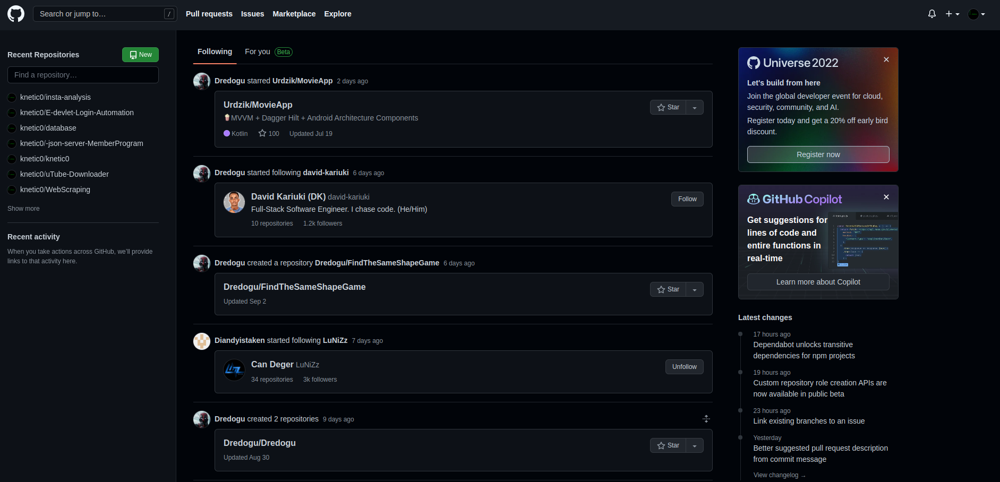
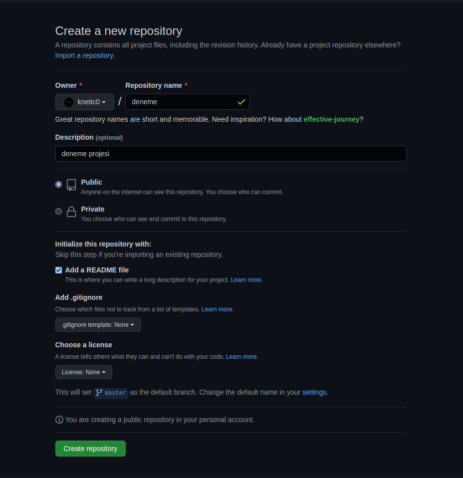
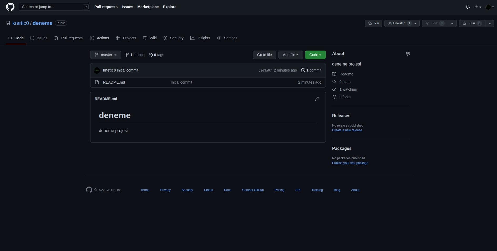
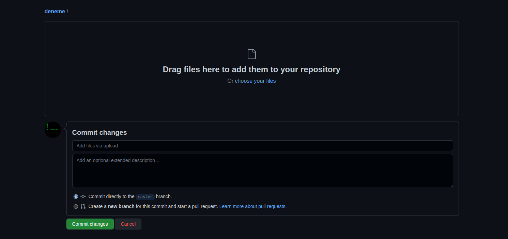
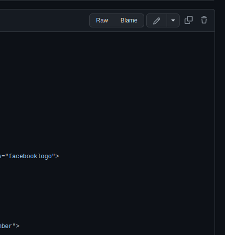
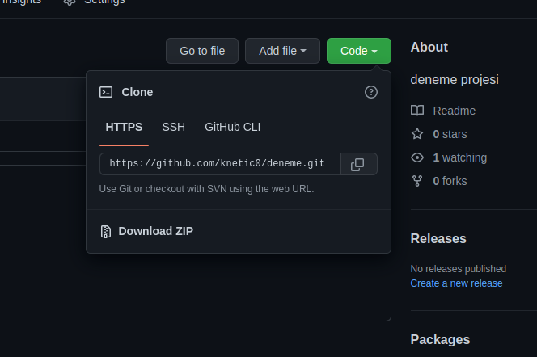
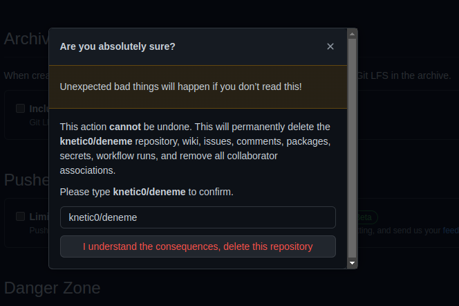
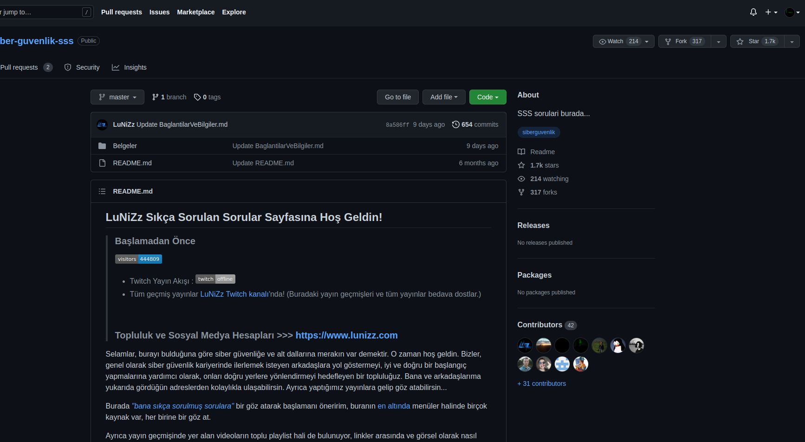
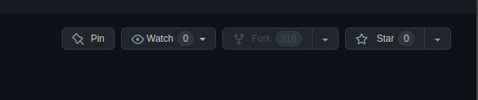
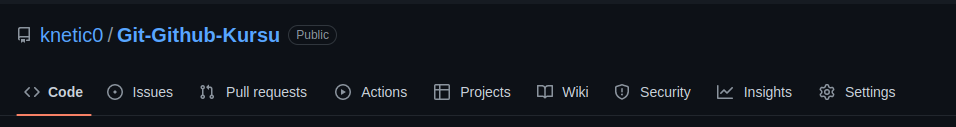

# <center>Github Kullanımı</center>

<center></center>

<br />

**Evet, Github eğitimimize hoşgeldiniz. Daha önce Git kursunu yayınlamıştım. Şimdi Github'a başlayalım.**

<br />

>## Github Nedir ? 

<br />

**GitHub; kalabalık bir ekibin sürüm kontrol sisteminde bir yazılım geliştirirken kullanabilecekleri internet tabanlı bir depolama servisidir. GitHub, Git yönetim sistemi ile geliştirilen yazılımlarda kullanılır. Açık kaynak kodlu bir servis olması nedeniyle pek çok yazılım ekibi tarafından kullanılmakta ve geliştirilmektedir.**

<br />

>## Peki Github Ne İşe Yarar ?

<br />

**GitHub servisi sayesinde pek çok kişiden oluşan kalabalık yazılım geliştirici ekipler bile aynı anda aynı proje üzerinde çalışabilir ve ayrı değişiklikler yapabilirler. Bu servis üzerinden geliştirilen projelerde ekip büyük bir zaman kazanır.**

**GitHub yalnızca geliştirici ekibin değil, yazılımı hazırladıkları müşterinin de kullanabileceği bir alan sunar.**

<br />

> **Başlayalım. Öncelikle Kayıt Olalım.**

<br />


<br />

**Öncelikle ```https://github.com/``` bu linkten Sign up butonuna basarak kayıt olalım. Kayıt olduktan sonra bizi bir arayüz karşılayacaktır.**

<br />




<br />


<br />

>## Repository Nasıl Oluşturulur ?

<br />

**Sol kısımda bulunan ```New``` butonuna basıyoruz. Açılan yerde gerekli ayarlamaları yapıyoruz.**

<br />



**Burada biraz kavramlardan bahsetmek istiyorum.**

**```Repository``` - Repository veya repo, projelerinizin dosyalarının depolandığı bir dizindir. GitHub'ın alanında veya bilgisayarınızdaki yerel bir depoda bulunabilir. Dosyalar, fotoğraflar, sesler veya projenize alakalı her şeyi repository'inizde depolayabilirsiniz. Burada Repository name kısmına Projemizin adını yazıyoruz.**

**```Description``` - Buraya opsiyonel olarak açıklama ekleyebiliriz. Kısaca projemizden bahsedebiliriz.**

**```Public - Private``` - Projemizin herkese açık bir şekilde yayınlanmasını istiyorsak Public, Erişim sadece bana ya da istediğim kişileri sağlansın diyor isek Private seçeneğini seçelim. Ben Public seçeneğini seçiyorum.**

**```README file``` - Oluşturulan proje hakkında açıklamalar yaptığımız kısım. Description kısmına nazaran daha uzun, kapsamlı ve derinlemesine açıklamalar yapılır.**

**```.gitignore``` - Git reposundan hariç tutulacak dosyaların listesinin bulunduğu repo ana dizinde bulunan bir ayar dosyasıdır. Ana dizinde oluşturduğumuz . gitignore dosyasını git okuyup belirtilen kriterleri es geçecektir.**

**```LICENSE``` - LICENSE dosyası reponuzda bulundurduğunuz dosyaları kapsayan (aynı zamanda koruyan) lisansınızı belirtir. Koşulları sizin seçtiğiniz lisansa göre değişir.**

<br />

> Create repository seçeneğine basılır ve Repository oluşturulur.



**```Add file > Upload files``` kısmından dosyalarımızı manuel bir şekilde yükleyebiliriz. git push yöntemi Git kursumuzda bulunmakta.**



**Burada ```choose your files``` seçeneğine basarak ya da sürükle bırak sistemi ile dosyalarımızı yükleyebiliriz. Commit changes butonuna basarak dosyamızı yükleyebiliriz.**

**Silmek istersek yüklediğimiz dosyaya basarız ve sağ da bulunan çöp kutusuna basmalıyız ve Commit changes ile onaylamalıyız.**



<br />

**Projeyi indirmek için ya da clone https, SSH linklerine erişmek için yeşil Code butonuna basılır.**



**Projeyi silmek için Settings menüsüne gidilir. General kısmından aşağı inilir ve Delete this repository seçeneği seçilir.**



**Şifre girmenizi isteyebilir. Şifrenizi girdikten sonra projeniz silinecektir.**

**Evet proje oluşturmayı, indirmeyi, projeye dosya yüklemeyi, dosyayı silmeyi, projeyi silmeyi öğrendik. Şimdi diğer kavramlara geçelim.**


**```Fork``` - Projenin bir kopyasını üzerimize alıp, o kopyadan o sürümden çalışmak. Bir projeye katkıda bulunmak istiyorsak projeyi fork ederiz.**



**Evet fork etmek istediğim projeye eriştim ve sağ üstte bulunan Fork seçeneğine basıp Fork ettim. Artık bu proje üzerinde oynamalar yapıp sunabilirim.**



**```Push``` - Commit işlemiyle paketlenen yeni çalışmanın GitHub sunucusuna Push edilmesi ( İtilmesi) yani gönderilmesi işlemini ifade eder. Git dersimizde bu komutu görmüştük. Projemiz bittiğinde bu komut sayesinde github'a projemizi yükleyebiliriz.**

```
git push origin master
```

**```Pull``` - Başkalarınca yapılan değişikliklerin kendi bilgisayarınız veya sunucudaki ana dosya versiyonuna dahil etmek (çekmek) işlemidir.**

```
git pull [<repository>]
```



**```Issues``` - Türkçesi durum olarak adlandırılabilen issues kelimesi ile bir durum, sorun veya gelişme ile ilgili bilgilendirme açmak denebilir. Projeye dahil olanlar issues açıldığı zaman isterse konuya dahil olup durumun gerektirdiği işlemi yapar ve issues kapatılabilir.**

**```Pull Request``` - Fork edilen proje üzerinde değişiklikler yaptıktan sonra gerçek repository’e gönderilerek o projenin sahibi olan geliştiricinin değerlendirmesine sunmaktır. Eğer PR kabul edilirse ana repository üzerinde, fork ettiğiniz proje üzerinde değişiklikler işlenir.**

<br />

>## Collaborators Nedir ?

<br />

**Collaborators, erişim kazandıkları başka birinin kişisel havuzlarında bir dizi eylem gerçekleştirebilir.**

> **1- Repoda pull requests oluşturun, merge işlemini yapın ve kapatın. <br />
2- Paketleri yayınlayın, görüntüleyin, yükleyin.  <br />
3- Repository'leri forklayın. <br />
4- Pull requestslerin önerdiği şekilde depolarda değişiklikleri yapın. <br />
5- Sorunları veya istekleri yinelenen olarak işaretleyin. <br />
6- Repodaki taahhütler, pull requestsleri ve sorunlar hakkında herhangi bir yorum oluşturun, düzenleyin ve silin. <br />
7- Repolarda collaborators olarak kendilerini kaldırmak. <br />
8- Repolardaki sürümleri yönetin.**

