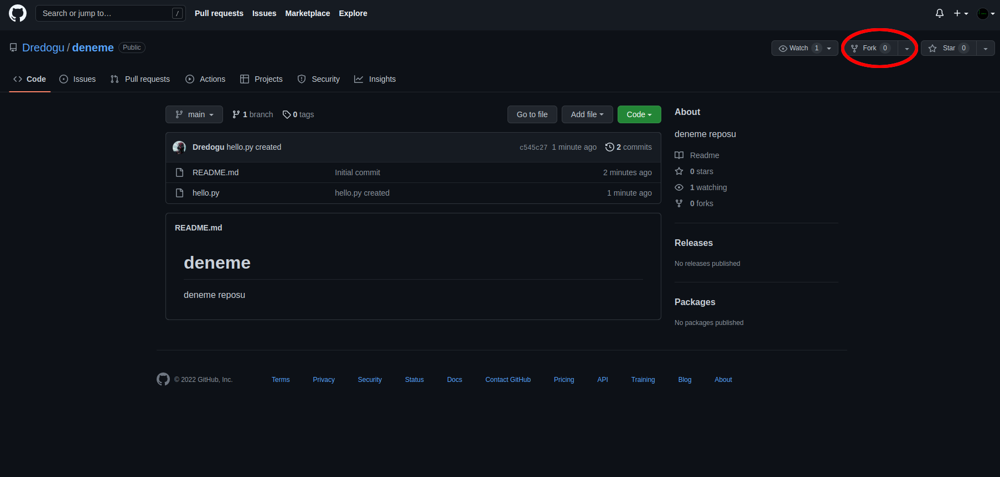
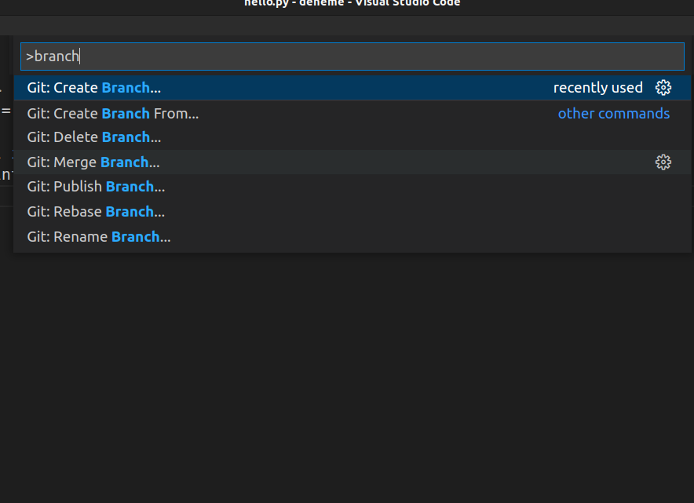

# <center>VSCode İle Çalışmak - Orta Düzey Git ve Github Kursu</center>

> **Evet bu kursdan önce kendi oluşturduğumuz projelerimizi Github'a yüklemiştik. Ayrıca bu yüklemeyi manuel olarak yüklemiştik. Bu bireysel çalışmalarda kullanılabilecek bir yöntem ama ileri düzey çalışmalarda bu yöntemin kullanılması pek uygun değil. Bugün öğrendiğimiz bütün kavramlarla önce Github projesi clone işlemi yapıcaz ardından sırasıyla adımları uygulayacağız. Branch işlemi, add, commit, merge, push, pull işlemlerini bir proje üzerinden anlatıcam.**

> **Github üzerinden bir proje belirleyelim ve bu projeyi forklayalım. Bu sayede proje üzerinde oynamalar yapabilecek ve en önemlisi bunları pushlayabileceğiz. Daha sonra Pull Requests ile merge işlemini yapıcağız.**



> **Bu şekilde geliştirmek istediğimiz projeyi forklayabiliriz. Forkladığımız zaman bu repository artık bizim repositorylerimize dahil olacaktır.**

> **Şimdi clone işlemine geçelim. Kendi repositorylerimize erişelim ve forkladığımız projenin https linkini kopyalayalım.**


> **Evet clone işlemimiz için Reponun linkini aldık. Artık projeyi kendi alanımıza dahil edebiliriz. Terminal kullanarak ya da Git bash sayesinde projeye clone işlemini uygulayalım.**


> **Burada clone işlemini uyguladık ve projeyi Github'dan kendi alanımıza aktardık. Artık oynamalar, eklemeler yapabilir ve bunları pushlayabiliriz. Öncelikle ```git status``` yapalım. Unutmayalım ne olursa olsun git status yapılmalı.**


> **Her şey yolunda. Artık yeni bir branch oluşturabiliriz. ```git branch <isim>``` komutuyla bir branch oluşturalım. Ben feat adında bir branch oluşturucam. ```git branch feat``` komutu bana feat adında bir branch oluşturucaktır. Ardından ```git switch feat``` komutu ile master/main branchinden feat branchine geçiş yapalım ve işlemlerimize başlayalım. ```git branch``` komutu ile branchlerimize bakalım.**


> **VS Code üzerinden branch oluşturmak için öncelikle projemizi VS Code üzerinden açıyoruz. ```ctrl + shift + p``` kısayolu ile Command Palette'i açıyoruz. branch yazıyoruz ve ```Create Branch``` seçeneğini seçiyoruz ardından branch ismimizi yazıp Enter'a basıyoruz.**




> **Evet, Terminal üzerinden ve VS Code üzerinden branch oluşturmayı öğrendik. ```git branch``` komutu ile terminalimizden branchleri inceleyebiliriz. Şimdi gerekli işlemlerimiz yapalım. Bir dosya oluşturmak istiyorum ve içinde bir fonksiyon oluşturucağım. Kısacası bana verilen görevi yerine getiriceğim. Ardından ```add``` ve ```commit``` işlemlerine geçicez.**


> **Bize verilen görevi başarıyla bitirdik. Artık bunu önce ```add``` ardından ```commit``` ile depolayalım.**


> **Bu şekilde ```add``` işlemimizi bitirdik. Terminale ```git add .``` yaparak da işimizi görebilirdik. Değiştirdiğimiz bütün dosyaları VS Code üzerinden bu şekilde add'leyebiliriz. Şimdi ```commit``` işlemine geçelim.**


> **Evet, bu şekilde ne yaptığımızı yazıp Commit butonuna basarak Commit işlemimizi bitirdik. Pull request işlemine geçmeden önce ```merge``` konusuna değinmek istiyorum. Aslında ortak projelerde pull request atılmalı ama merge'ü anlamak için göstermek istiyorum. ```CTRL + SHIFT + P``` ile Command Palette'i açıyoruz ve ```Checkout to``` yazıp ardından main/master fonksiyonuma geçiş yapıyorum. Checkout, switch ile aynı işlevi görür.**


> **Artık main branchimizdeyiz ve merge işlemine geçebiliriz.**


> **Bu şekilde ```merge``` işlemi bitti. Artık ```push``` işlemine geçebiliriz. Birazdan pull request işlemine geçiş yapıcağız. Open, open diyerek hesap onayı veriyoruz. Aşağıdan takip edebilirsiniz.**


> **Pull request işlemine geçelim. Öncelikle pull request nedir ?**

> **Fork ettiğimiz projenin üzerinde çalışarak proje üzerinde yaptığımız değişiklikleri, projenin sahibine pull request şeklinde gönderebiliriz. Pull request olarak göndermenin anlamı; proje üzerinde değişiklik yaptım, sen de bu değişiklikleri onaylarak projene merge et demek anlamına gelir.**


> **Pull request işlemi bitti. Owner'ın onaylamasını beklemeliyiz. Onaylandığı zaman aşağıda gördüğünüz üzere Owner'ın sayfasında yaptığımız değişiklikler gönderildi.**

